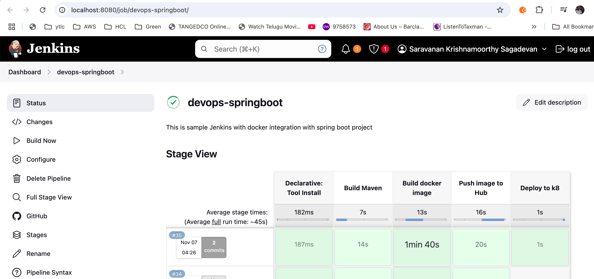

# Devops Jenkins CI CD automation Springboot project
# Project Name
DevOps Spring Boot

## Technologies Used
- **Java 17** (for backend development)
- **Spring Boot** (for microservices)
- **React.js** (for frontend)
- **Docker** (for containerization)
- **Kubernetes** (for Container orchestration)
- **AWS Services** (for cloud deployment)
- **PostgreSQL** (for database)

## Description
This project demonstrates a sample Jenkins pipeline with multiple stages for deploying applications using Docker containerization. It includes automated build, test, and deployment steps to streamline the CI/CD process.

Explanation of Jenkins Pipeline Stages

**1. Checkout Stage**
- Clones the repository from GitHub.
- Ensures that the latest source code is pulled into Jenkins.

**2. Build Stage**
- Runs a Maven build (mvn clean package) to compile and package the application.
- Ensures the application is ready for deployment.

**3. Build Docker Image**
- Uses a Dockerfile to create an image of the application.
- Tags the image with a meaningful name (my-app:latest).

**4. Push to Docker Registry**
- Uses Jenkins credentials (docker-hub-credentials) to log in to Docker Hub.
- Pushes the newly built Docker image to a registry (my-docker-repo).

**5. Deploy Stage**
- Runs a container from the pushed Docker image.
- Exposes the application on port 8080.

## Additional Enhancements
- **Automated Testing:** Add a Test stage using JUnit or integration tests before deploying.
- **Environment Variables:** Store sensitive data in Jenkins credentials instead of hardcoding.
- **Notifications:** Add Slack/email notifications for success/failure.
- **Kubernetes Deployment:** Instead of docker run, you can deploy using Kubernetes (kubectl apply).

- Jenkin Stage View snipshot
- 
